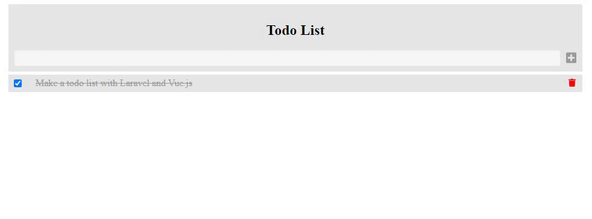

# Todo List

A full stack todo list web application using Laravel and Vue.js.

## Built With

* [Laravel](https://laravel.com/) - The php framework used
* [Vue.js](https://vuejs.org/) - The javascript framework used
* [Font awesome](https://fontawesome.com/how-to-use/on-the-web/using-with/vuejs) - Used to add icons

## Authors

* **Kasper Beljaars** - *Project created* - [KasperOfzeau](https://github.com/KasperOfzeau)

## License

This project is licensed under the MIT License - see the [LICENSE.md](LICENSE.md) file for details

## Acknowledgments

* [Youtube Tutorial](https://www.youtube.com/watch?v=UHSipe7pSac&t=2759s) - Youtube tutorial from [Scrypster](https://www.youtube.com/channel/UCR1_G0EoEIb87wi3GPlk-CQ)

